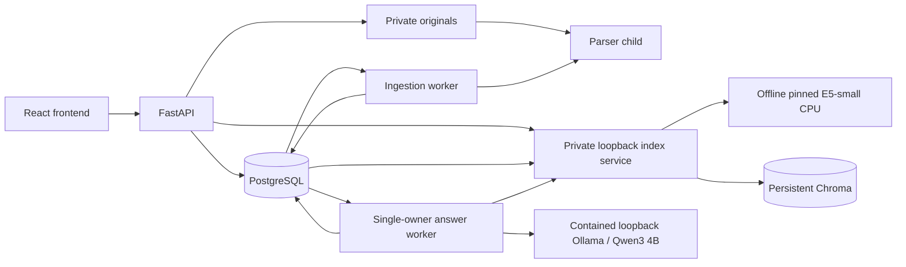

# Architecture

One React frontend calls a modular FastAPI application. PostgreSQL stores authentication, source metadata, exact passages and durable jobs. Separate ingestion, single-owner indexing and answer-worker processes handle parsing, embeddings and generation. Originals are private local files; no public static mount exists.

## Authentication

Argon2id password hashes; HS256 access JWTs with required claims and a ten-minute default lifetime. Protected requests also check live user/session records, so role/status/revocation are database-authoritative. Refresh tokens are opaque values stored as SHA256 digests; rotation row-locks sessions and replay revokes them. Default absolute expiry is seven days, with at most 256 consumed digests per session.

Frontend access tokens stay in memory. Refresh cookies are host-only, HttpOnly, Strict and `/auth` scoped; production requires Secure/HTTPS. Credentialed CORS uses exact origins and mutations check Origin plus CSRF header. Web Locks serialize cross-tab refresh; unsupported browsers may require login after a race. Persistent account/IP throttling counts all attempts. Uvicorn proxy headers remain disabled in local setup.

## Data model

UUID keys, foreign keys, constraints and timezone-aware timestamps are defined in [auth models](../backend/app/models.py) and [document models](../backend/app/document_models.py).

| Tables | Responsibility |
| --- | --- |
| users, auth_sessions, auth_throttles | Accounts, revocation/rotation and durable login limits |
| schemes, documents | Logical source grouping, identity and archive state |
| document_versions | Immutable original identifiers/metadata, unique corpus checksum, version number and verification |
| version_relationships | Explicitly verified amendments/supersession with evidence and scope |
| extracted_pages, chunks | Physical-page text, exact offsets, flags and replaceable chunk profile |
| ingestion_jobs | One persisted job per version, state, attempt count, progress and lease ownership |
| eligibility_reviews | Append-only evidence/reason/scope/reviewer decisions, separate from immutable originals |
| index_generations, index_state | Pinned model/chunk spec, reviewed source snapshot, durable lease/progress and atomic active pointer |
| index_passages | Generation-scoped exact page/text spans; old provisional chunks remain intact |
| answer_runs | Owned questions, terminal results, immutable grounding/model snapshots and sanitized errors |
| answer_worker | Singleton heartbeat for request availability |
| answer_claims, claim_citations | Ordered candidate/retention assessments, stable citation IDs, exact quote/version/page offsets and model/review snapshots |

Alembic revisions `0001_auth`, `0002_documents`, `0003_retrieval` and additive `0004_answers`/`0005_citations` are explicit. Startup does not create tables. PostgreSQL triggers protect original-version fields and forbid eligibility-review update/delete. Corrections append a new reviewed decision.

## Ingestion

Admin authorization precedes streaming. Upload enforces actual byte limits and validates content in a child parser, then publishes a generated no-overwrite original and commits version/job metadata. Same bytes/same metadata reuse the version; conflicting metadata returns 409. Grace-period orphan reconciliation handles interrupted file/database publication.

Workers claim with `FOR UPDATE SKIP LOCKED`, owner UUID and expiring lease. Heartbeats extend ownership; stale-worker fencing prevents late result publication. Pages/chunks and terminal state commit atomically. Expired processing jobs can recover up to three attempts; controlled retry is limited to failed jobs below the cap.

PDF text preserves physical page numbers and exact `get_text('text', sort=False)` output. UTF-8 TXT uses character spans without invented PDF pages. Chunk profile `unicode-char-v1:1200:120` is provisional; detected labels are heuristic and long paragraphs carry continuation flags. Low-text pages are OCR-pending; mixed PDFs are partial. Original PNG preview and download require admin authorization and integrity checks.

Limits: 50 MiB stream, 60-second upload read deadline, 30-second default parser deadline, 500 pages and 2,000,000 extracted characters. Parser children are not an OS sandbox and have no hard memory quota. No malware scan is available; table layout and encoding need review. API liveness is independent of DB/worker/AI; readiness requires current DB/schema and authentication.

## Retrieval

The [encoder](../backend/app/embedding.py) explicitly prepares a pinned safetensors model outside Git, loads offline without remote code, and supplies all embeddings to Chroma. Hindi/English queries share the same normalized 384-dimensional space. Query/passage prefixes and special tokens count toward the 512-token maximum. New chunks target 448 tokens with 48-token overlap and heuristic newline/section boundaries; exact half-open offsets, continuation flags and original physical pages survive. No reparse of immutable originals is needed.

[Eligibility](../backend/app/eligibility.py) requires a latest audited verified review, recorded reuse scope, completed extraction, active document and no explicit superseding relationship. Historical/unknown applicability remains visible. Partial/OCR-pending sources are excluded. A changed review blocks the old index snapshot immediately, even if still positive; rebuild to include it. Archive/rejection is rechecked from SQL after vector work. Regular users inspect eligible indexed text only; original/PNG routes remain admin-only because permitted narrative scope excludes graphics.

[Index runtime](../backend/app/vector_index.py) creates one collection per generation with an exact model revision/dimension/normalization/metric/chunk spec. It checks actual cosine configuration and disables Chroma's embedding function. Stable passage UUIDs derive from generation/page/span; batches of eight use idempotent upserts. SQL leases last 180 seconds with heartbeats and stale-owner fencing, capped at three attempts. Only exact vector-ID coverage plus current source-review checks can atomically publish the active pointer. Failure preserves the previous ready generation. Reconciliation removes orphan IDs and invalidates missing-vector generations; historical SQL/collections are retained pending explicit garbage-collection design.

[Single-owner service](../backend/index.py) holds a Windows file lock before model/Chroma loading. Worker and query operations share one nonblocking runtime lock; busy queries return 503 rather than overlap. It binds 127.0.0.1:8011 with a private HMAC-derived internal key, no public schema or CORS. The ordinary [search API](../backend/app/search_api.py) checks live auth/CSRF, applies persistent IP throttling (50 requests per 15 minutes by default) and uses a 20-second IPC timeout. Model loading never occurs during API startup. CPU uses two Torch threads; GPU inference is not configured.

Search accepts 2–2000 characters, rejects actual prefixed input over 512 tokens, returns at most ten passages, and supports exact scheme/issuer/type and publication-date filters. Unknown dates are explicitly included/excluded when date filtering. SQL eligibility precedes Chroma filtering, and candidate retrieval covers the bounded corpus (100 versions/20,000 passages) so excluded hits cannot consume the requested count. This small-corpus strategy is not a scalable search benchmark. Every returned text is checked against the stored source-page span. Similarity >=0.78 is a labeled uncalibrated relevance heuristic; it cannot establish claim support or entitlement.

Limited claim-support checks are described below; complete semantic/legal interpretation, OCR, scoring and saved-answer/feedback workflows remain deferred. See [maintainer state](MAINTAINER.md).

## Local answers

[Ask API](../backend/app/ask_api.py) accepts owned, CSRF-protected requests. PostgreSQL advisory locking plus a partial unique index allow one queued/processing request globally, without an unbounded inference queue. A 15-second worker heartbeat gates submissions. History is owner-filtered; another user's UUID returns 404. Records retain question/language/filters, validated claims, exact source/version/page/span/review snapshots, index generation, model digest/settings, prompt/schema revisions, timings and sanitized errors. Terminal records older than 30 days are removed at worker startup and hourly while active; backups have separate retention. Raw generation prompts/output and thinking are neither logged nor stored. Structured candidate claim text and assessments are retained privately for audit, including rejected candidates; their factual text is not returned in API explanations. Disable API access logs to avoid identity-bearing URLs.

[Worker](../backend/app/answer_worker.py) uses replaceable [retrieval/generation interfaces](../backend/app/rag_engine.py). Retrieval calls the existing keyed service, never a second E5 model. Conservative keyword scope checks distinguish historical questions, ambiguous requests and unsupported current-policy advice; these are not comprehensive intent classification. The model also evaluates answerability. Empty/insufficient evidence makes no generation call; service failures remain errors.

The complete raw Qwen control template, system/schema, escaped untrusted question/excerpts and output reserve use the pinned **LLM** tokenizer. Whole lower-ranked passages are removed until prompt + 768 output + 64 safety tokens fit 4096. No excerpt is silently clipped; omissions are disclosed. Ollama truncation/context shifting are disabled. Actual prompt counts must equal preflight counts; unexpected thinking, truncation or oversized responses fail. Structured output permits at most one concise claim; only final validated results appear in the UI. Repair is bounded to one additional generation and never uses model memory as fallback.

[Grounding](../backend/app/grounding.py) supplies exact excerpt handles. The model selects IDs/handles; the server reconstructs original quote text and page offsets, preventing altered PDF whitespace. Extra fields, invented IDs/excerpts, non-exact spans, basic unsupported numbers/currencies/months and one explicit negation case are rejected. These checks do **not** prove semantic entailment, numeric association, exhaustive conditions, translation quality or complete date interpretation. Broad page excerpts can contain unrelated values. High-signal instruction paragraphs are omitted and Qwen control tokens escaped, but this is not a comprehensive prompt-injection defense. The separate Part 6 method adds conservative support checks; it does not establish complete semantic entailment. Trust stays null.

Sources are rechecked after inference and row-locked through publication against live SQL eligibility, latest review, ready generation and original page spans. Changed sources produce an error, never a new answer from stale evidence. Later history views apply current access/provenance checks under source locks. A revoked/changed source withholds the entire answer and all excerpt text, while preserving its private SQL snapshot. Referenced old-generation SQL remains inspectable after index rebuild when the original review remains eligible.

[Contained Ollama](../backend/app/ollama_local.py) uses an exclusive project lock and Windows kill-on-close job containing server/runner descendants at 127.0.0.1:11435, a separate private model store, cloud disabled, one loaded model/parallel request/queue slot. The worker has a 120-second processing deadline and 120-second queued TTL; generation HTTP read/load limits are 60 seconds. Cancellation/timeouts cancel the HTTP task and replace the complete owned process tree. A fresh worker marks interrupted processing jobs as errors rather than regenerating silently. These are execution/token bounds, not hard RAM/VRAM quotas. The personal Ollama service/cache is untouched.

## Claim support and citation access

[Provenance](../backend/app/citations.py) matches each quote and passage to authoritative extracted-page text, original version and half-open offsets. Surrounding complete paragraphs clarify conditions; over-budget contexts are rejected rather than clipped. Missing dates/clauses stay null; detected section labels remain heuristic. UUID5 claim IDs use run/order/text; citation IDs use claim/order/passage. [Additive tables](../backend/app/citation_models.py) store exact candidate text, retention, controlled reason, method/revision and original/model/review snapshots. Existing answer JSON is never migrated/reassessed; old views derive presentation IDs and show `not_evaluated` without writes. No reassessment API exists.

[Support](../backend/app/support.py) checks final displayed English/Hindi text. Lexical guards associate currency/value/frequency, Indian/Devanagari numbers, land-holding/SMF categories, explicit negation, historical scope and selected same-scheme annual conflicts. Remaining questions go to the existing Qwen model with exact quote/context, bounded strict JSON and controlled reason codes. This is a same-generator heuristic, not independent evidence, legal verification or complete named-entity/condition reasoning. Similarity never sets support. Outcomes: `supported_by_check`, `unsupported`, `conflicting`, `insufficient_context`, `not_evaluated`.

Judge prompt + 256 output + 64 safety tokens must fit the same 4096 context. One judge call/candidate, 30-second deadline; no judge repair/fallback. Production output remains one claim; internal evaluation permits up to five candidates. Missing/invalid/timed-out verification fails closed. Source gates run before/after support and under row locks through final publication; explicit relationship creation takes the same version locks. The answer is rebuilt only from retained checked claims; none retained means abstention, mixed retention means partial. No unchecked streaming.

Owned citation text routes validate current eligibility/review and the original page span independently of the active index pointer. Normal users can inspect approved narrative text; originals/PNG remain admin-only. History redaction is deliberately conservative if any recorded source becomes unavailable/revoked. Already delivered client text cannot be withdrawn; fresh reads and failed inspection refresh current access. Thirty-day answer deletion cascades its claim/citation records. These snapshots have no edit API, not DB-wide immutability guarantees against privileged manual SQL.
