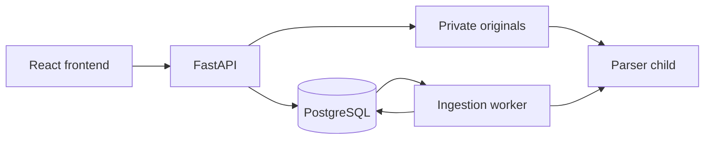

# Architecture

One React frontend calls a modular FastAPI application. PostgreSQL stores authentication, source metadata and durable jobs. A separate worker runs bounded parser child processes. Originals are private local files; no public static mount exists.

## Authentication

Argon2id password hashes; HS256 access JWTs with required claims and a ten-minute default lifetime. Protected requests also check live user/session records, so role/status/revocation are database-authoritative. Refresh tokens are opaque values stored as SHA256 digests; rotation row-locks sessions and replay revokes them. Default absolute expiry is seven days, with at most 256 consumed digests per session.

Frontend access tokens stay in memory. Refresh cookies are host-only, HttpOnly, Strict and `/auth` scoped; production requires Secure/HTTPS. Credentialed CORS uses exact origins and mutations check Origin plus CSRF header. Web Locks serialize cross-tab refresh; unsupported browsers may require login after a race. Persistent account/IP throttling counts all attempts. Uvicorn proxy headers remain disabled in local setup.

## Data model

UUID keys, foreign keys, constraints and timezone-aware timestamps are defined in [auth models](../backend/app/models.py) and [document models](../backend/app/document_models.py).

| Tables | Responsibility |
| --- | --- |
| users, auth_sessions, auth_throttles | Accounts, revocation/rotation and durable login limits |
| schemes, documents | Logical source grouping, identity and archive state |
| document_versions | Immutable original identifiers/metadata, unique corpus checksum, version number and verification |
| version_relationships | Explicitly verified amendments/supersession with evidence and scope |
| extracted_pages, chunks | Physical-page text, exact offsets, flags and replaceable chunk profile |
| ingestion_jobs | One persisted job per version, state, attempt count, progress and lease ownership |

Alembic revisions `0001_auth` and `0002_documents` are explicit. Startup does not create tables. A PostgreSQL trigger protects original-version fields; verification/extraction revision fields are separate.

## Ingestion

Admin authorization precedes streaming. Upload enforces actual byte limits and validates content in a child parser, then publishes a generated no-overwrite original and commits version/job metadata. Same bytes/same metadata reuse the version; conflicting metadata returns 409. Grace-period orphan reconciliation handles interrupted file/database publication.

Workers claim with `FOR UPDATE SKIP LOCKED`, owner UUID and expiring lease. Heartbeats extend ownership; stale-worker fencing prevents late result publication. Pages/chunks and terminal state commit atomically. Expired processing jobs can recover up to three attempts; controlled retry is limited to failed jobs below the cap.

PDF text preserves physical page numbers and exact `get_text('text', sort=False)` output. UTF-8 TXT uses character spans without invented PDF pages. Chunk profile `unicode-char-v1:1200:120` is provisional; detected labels are heuristic and long paragraphs carry continuation flags. Low-text pages are OCR-pending; mixed PDFs are partial. Original PNG preview and download require admin authorization and integrity checks.

Limits: 50 MiB stream, 60-second upload read deadline, 30-second default parser deadline, 500 pages and 2,000,000 extracted characters. Parser children are not an OS sandbox and have no hard memory quota. No malware scan is available; table layout and encoding need review. API liveness is independent of DB/worker/AI; readiness requires current DB/schema and authentication.

## Future modules

Embeddings/retrieval, local generation, claim citations, OCR, scoring, history/feedback and evaluation remain unimplemented. PostgreSQL source records will remain authoritative; any vector index must be derived and replaceable. See [maintainer state](MAINTAINER.md).
