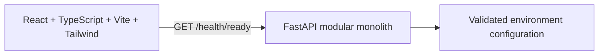

# Architecture and initial relational data design

## Part 1 foundation, preserved

In the historical Part 1 release, only configuration and health routes were implemented. `/health/live` proved process responsiveness without AI. `/health/ready` reported configuration validated, then the only required dependency. PostgreSQL, Chroma and Ollama were not required or probed. Current Part 2 readiness checks are described below. A dependency name appearing in readiness is not proof of connectivity.

Application errors use `{ "error": { "code": "...", "message": "...", "request_id": "..." } }`. Each request gets a server-generated UUID in X-Request-ID; submitted request IDs are not trusted. Unexpected exception text is not exposed to clients. Framework-level CORS preflight denial uses CORSMiddleware's own 400 response and is separate from the application error envelope. No credentials/cookies are allowed by Part 1 CORS. The backend binds loopback; it has no authentication and is not intended for public exposure.

## Planned modular monolith

React pages will call one FastAPI API. Internal modules will handle auth/users, document ingestion, retrieval, generation, citations, scoring and analytics. PostgreSQL owns transactional metadata and job state; Chroma owns replaceable derived embeddings; local storage holds immutable originals and extraction artifacts. Ollama inference remains local and replaceable. Ingestion work must be durable and resource-bounded, with processing initiated from persisted jobs rather than relying solely on in-memory background tasks.

Part 1 implemented no database models/migrations. Part 2 implemented users, auth_sessions and auth_throttles. Part 3 adds schemes, documents, document_versions, version_relationships, extracted_pages, chunks and ingestion_jobs; query/RAG/vector entities remain planned.

## Part 3 delivered document flow

Admin React form → authenticated raw byte stream API → bounded parser validation → generated private original + immutable version/job transaction → separate PostgreSQL worker → fenced atomic page/chunk result transaction → protected admin inspection and PNG original-page preview.

Originals default to LocalAppData/GovPolicyAgent/data outside OneDrive. Storage keys are generated relative UUID names. Database and original storage must be backed up together. Publication uses no-overwrite linking; explicit reconciliation removes only old generated orphan files after a grace period.

Worker claims use FOR UPDATE SKIP LOCKED, an owner UUID, expiring lease and heartbeat. A stopped worker leaves durable jobs; expired jobs can be reclaimed up to three attempts. Ownership fencing prevents stale workers publishing results. Parsing runs in killable children with wall/page/text limits; it has no OS sandbox or hard memory quota. API liveness remains independent of the worker and AI; readiness requires configured PostgreSQL/current schema/authentication.

Physical PDF pages and exact Unicode text offsets remain traceable. Provisional chunks use 1200 characters and 120 overlap, with heuristic labels only. Low-text scanned pages remain needs_ocr; mixed documents are partial. OCR, embeddings, semantic retrieval, legal-status inference and trust scoring are deferred.

The three official-origin corpus PDFs total 164 pages/398 chunks. Origin verification is separate from reuse permission; all remain local-reference-only and none is eligible for future retrieval. See [corpus manifest](corpus_manifest.json), [setup](SETUP_PART3.md) and [learning guide](learning/PART_03_EXPLAINED.md).

## Current Part 2 authentication architecture

React hash routes preserve the foundation screen and add registration, login, protected account/profile and an admin access page. One FastAPI process uses synchronous SQLAlchemy 2 + psycopg 3 from worker-thread endpoints/dependencies. Alembic creates the schema explicitly. App startup only prepares a connection pool; it never creates tables or needs a DB connection for liveness.

`users` has normalized unique email/username, Argon2id password hash, constrained user/admin role and en/hi/hinglish preference, active flag and timezone-aware timestamps. Public registration rejects extra fields and always sets role=user. `auth_sessions` has a UUID user FK, current refresh SHA256 digest, bounded consumed digests, absolute expiry, revocation and rotation timestamps. `auth_throttles` has HMAC account/IP keys, a fixed window and attempt count. No plaintext password/refresh token is persisted.

Every protected request validates HS256 access JWT claims and checks live session/user records; the database role/active flag are authoritative. Rotation row-locks the session, consumes one digest and installs a new digest atomically; reuse revokes the session. Logout revokes before clearing the cookie. Admin authorization returns 401 without a session and 403 with a normal user. Profile updates only accept language preference.

Only 127.0.0.1 is used in development. CORS permits credentials for exact approved origins; all auth mutations verify Origin plus a custom CSRF header. Cookie is HttpOnly, Strict and path=/auth; Secure is mandatory for production. Frontend tokens are memory-only, with single-flight/Web Locks rotation and one bounded refresh retry. PostgreSQL is now required for readiness; Ollama/Chroma remain optional. See [SETUP_PART2.md](SETUP_PART2.md) for limits and production prerequisites. The earlier Part 1 description above is historical.

## Relational roadmap — auth delivered, other entities planned

All primary keys UUID unless stated; foreign keys and uniqueness constraints enforced in PostgreSQL. Use timezone-aware timestamps and explicit ownership. Do not log passwords/tokens or unnecessary question text. Retention/export/deletion behavior is defined before history is implemented.

| Entity | Main planned fields and relationships | First part |
| --- | --- | --- |
| users | id, unique email/username, password_hash, role, preferred language, active, created_at | 2 |
| auth_sessions | user_id FK, hashed refresh/session identifier, expires_at, revoked_at; never plaintext tokens | 2 |
| schemes | id, name, jurisdiction, issuing authority; verified official references | 3 |
| documents | id, scheme_id FK, title, issuer, document_type, official_url, provenance/reuse notes | 3 |
| document_versions | document_id FK, checksum unique within document, immutable storage path, language, publication_date nullable, effective_date nullable, ingested_at, verified_at nullable, verification status | 3 |
| document_relationships | from/to version FKs, amendment/supersession kind, verified source and scope/effective date; no automatic new-date override | 3–6 |
| ingestion_jobs | version_id FK, persisted state, attempts, stage, bounded progress, sanitized failure reason, started/finished timestamps; idempotency key | 3 |
| pages | version_id FK, 1-based page_number, exact extracted/OCR text, extraction method/revision, quality flags; unique(version,page) | 3,7 |
| chunks | version_id FK, page span, paragraph/section if known, original text, offsets/anchors, tokenizer and chunking revision | 3–4 |
| embedding_indexes | chunk_id FK, vector identifier, model/revision/dimension, index generation/status; derived data reconstructible from immutable chunks | 4 |
| conversations/queries | user ownership, original question/language, created_at, retrieval configuration, response/abstention state and measured latency | 5,9 |
| answers/claims | query_id FK, text, model/prompt revisions, each factual claim with support state and answer-text position | 5–6 |
| citations | claim_id/chunk_id/version_id FKs, page/section, exact passage and offsets, verification state/method; candidate similarity separate from proof | 6 |
| evidence_scores/components | answer_id FK, formula version, available coverage, overall nullable, six component values nullable plus missing reason/method | 8 |
| saved_answers | user_id/answer_id FKs, saved_at, unique(user,answer) | 9 |
| feedback | user_id/answer_id FKs, rating constrained to -1/+1, optional comment, timestamps, moderation state; ownership and duplicate policy | 10 |
| events/evaluation_runs | genuine query/errors/latency events; separate labeled test results with dataset and model revisions | 10–11 |

Original proposal tables remain recognizable, but immutable document versions, pages, claims and durable jobs are added to make evidence reproducible. Public corpus storage is distinct from private user history. Parsed/OCR text must never erase originals; translations stay separately labeled. Chroma vectors reference stable chunk/version identifiers and cannot be treated as authoritative source records.
